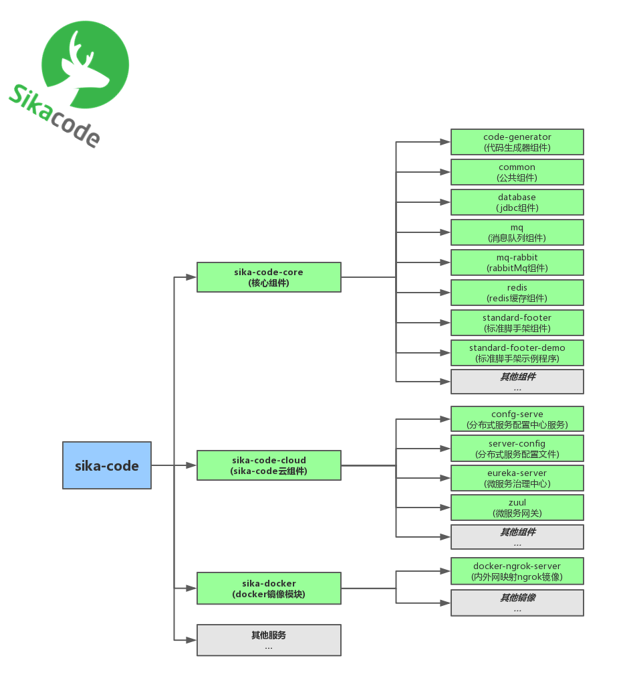
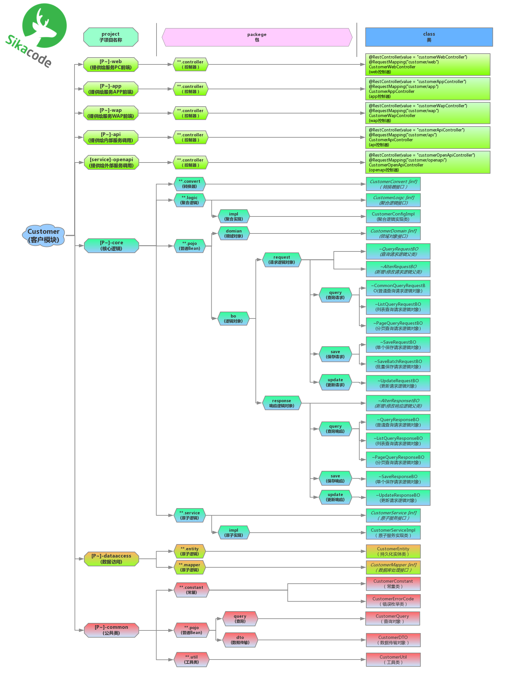

# ~~sika-code(简称EC) 企业级开发基础框架~~

# sika-code(简称AC) 企业级开发基础框架

> #### sika [梅花鹿] [优雅、简洁、规范而不失个性]

## 前言

### 宗旨：SikaCode、EasyCode

### When

- 发展自2017年12月

### What

- 构建在SpringBoot、SpringCloud上的基础性框架

### Why

- 提升代码质量
- 提高开发效率
- 屏蔽依赖细节
- 让世界没有不优雅的代码
- 简单、高效的开发出易维护、可拓展的高质量企业级项目

### How

- 抽象基础组件
- 约束代码规范

---

###    说明

- 享受各种开源组件带来的便利和惠泽。怀着无比感恩之心为开源尽一份微薄之力。
- SikaCode以spring-boot和spring-cloud为基础，同时定义一套微服务的相关规范，尽可能的降低企业维护成本。
- 如您觉得该项目对您有用，欢迎点击右上方的Star按钮，给予支持！！欢迎大家一起参与开发
- 由于我们经验见识有限，尽管殚精竭虑依旧有很多不足之处，非常期待接受您的意见和建议。欢迎大家加入sika-code开源项目组。

###     使用申明
- 为方便开发者初步使用、项目提供了可直接运行的环境资源
- 本开源项目所有可运行的资源包括但不限于(数据库资源、缓存资源、消息队列资源等等)，只可以用做测试之用。切勿进行压力测试
- 若要进行压力测试，请替换为自己的数据资源

---

## 项目基础架构

###  请求流程解析

- 前端请求->dns负载->nginx反向代理集群->zuul网关集群->聚合服务层->原子服务层->数据层访问层。

### 系统架构图

### 项目结构图

###  项目编码规范解析

- SikaCode推荐封装自己的工具类，业务逻辑类尽可能降低与第三方接口的依赖，从而方便统一管理及维护。

- SikaCode使用了模块化思想进行封装，分为工具模块和业务逻辑模块。

## 版本说明
- ~~AC_v1.x 基础版本~~
- AC_v2.x 模块化拆分、引入简化版本领域编程模式

### 提交反馈
- 欢迎提交 issue，请写清楚遇到问题的原因，开发环境，复显步骤。
- sika_code@163.com
- QQ群: 327424532

 

## 开发步骤

>#### 待续

## 持续开发中
