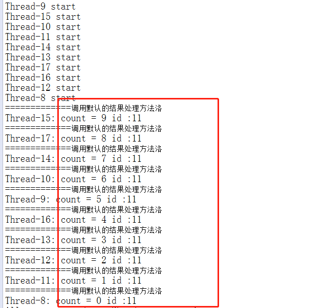

# 基于redis分布式锁使用教程

### 项目说明

​	目的：为了提高系统数据的安全性以及并发量

​	运行环境：jdk1.8、springboot

### 使用须知

1. 已经实现了基于redisson和jedis的分布式锁功能，因此需要引入redisson3.x版本以及commons-beanutils，以及jedis相关的依赖，默认配置为jedis

2. 使用redisson需要在resources\redisson目录下创建redisson-conf.yml配置文件如

   

3. 使用jedis需要在resources\config目录下创建redis-lock.properties

   

### 使用教程

#### redis分布式锁使用示例

测试的controller

```java
package com.easy.cloud.core.lock.test;

import java.util.Map;
import java.util.concurrent.CountDownLatch;

import org.redisson.api.RMap;
import org.redisson.api.RedissonClient;
import org.springframework.beans.factory.annotation.Autowired;
import org.springframework.web.bind.annotation.RequestMapping;
import org.springframework.web.bind.annotation.RequestParam;
import org.springframework.web.bind.annotation.ResponseBody;
import org.springframework.web.bind.annotation.RestController;

import com.easy.cloud.core.common.map.utils.EcMapUtils;

@RestController(value = "distributedLockTestController1")
@RequestMapping("/distributedLockTest")
public class LockTestController {
  	// 测试开的线程数量
	private int count = 10;
	@Autowired
	private RedissonClient redissonClient;

	@Autowired
	private LockTestService service;

	@RequestMapping(value = "distributedLockTest")
	@ResponseBody
	public String distributedLockTest(@RequestParam Map<String, Object> paramsMap) throws Exception {

		RMap<String, Integer> countMap = redissonClient.getMap("count");
		countMap.put("count", count);
		CountDownLatch startSignal = new CountDownLatch(1);
		CountDownLatch doneSignal = new CountDownLatch(count);
		for (int i = 0; i < count; ++i) { // create and start threads
			new Thread(new LockTestWorker(startSignal, doneSignal, service, redissonClient,
					EcMapUtils.getString(paramsMap, "id"))).start();
		}

		startSignal.countDown(); // let all threads proceed
		doneSignal.await();
		System.out.println("All processors done. Shutdown connection");
		return "finish";
	}
}

```

测试的Worker

```java
package com.easy.cloud.core.lock.test;

import java.util.Map;
import java.util.concurrent.CountDownLatch;
import org.redisson.api.RedissonClient;
import com.easy.cloud.core.common.map.utils.EcMapUtils;

public class LockTestWorker implements Runnable {
	private final CountDownLatch startSignal;
	private final CountDownLatch doneSignal;
	private final LockTestService service;
	private String id;

	public LockTestWorker(CountDownLatch startSignal, CountDownLatch doneSignal, LockTestService service,
			RedissonClient redissonClient) {
		this.startSignal = startSignal;
		this.doneSignal = doneSignal;
		this.service = service;
	}

	public LockTestWorker(CountDownLatch startSignal, CountDownLatch doneSignal, LockTestService service,
			RedissonClient redissonClient, String id) {
		this.startSignal = startSignal;
		this.doneSignal = doneSignal;
		this.service = service;
		this.id = id;
	}

	@Override
	public void run() {
		try {
			startSignal.await();

			System.out.println(Thread.currentThread().getName() + " start");
			Map<String, Object> person = EcMapUtils.newHashMap();
			person.put("id", Integer.parseInt(id));
			person.put("name", "张三");
			// 不加注解锁测试
			Integer count = service.unLock(id, person);
			// 指定注解锁所有的参数
//			Integer count = service.pointAll(id, person);
			// 指定注解的param属性
			// Integer count = service.pointParam(person, "张三");
			// 使用注解的默认的参数
			// Integer count = service.useDefault(id, "张三");
			System.out.println(Thread.currentThread().getName() + ": count = " + count + " id :" + id);
			doneSignal.countDown();

		} catch (InterruptedException ex) {
			ex.printStackTrace();
		}
	}
}
```

测试的service

```java
package com.easy.cloud.core.lock.test;

import java.util.Map;

import org.redisson.api.RMap;
import org.redisson.api.RedissonClient;
import org.springframework.beans.factory.annotation.Autowired;
import org.springframework.stereotype.Service;

import com.easy.cloud.core.common.log.annotation.EcLog;
import com.easy.cloud.core.common.log.constant.EcLogConstant.EcLogLevelEnum;
import com.easy.cloud.core.lock.annotation.EcLock;
import com.easy.cloud.core.lock.constant.EcLockConstant.EcLockTemplateTypeEnum;
import com.easy.cloud.core.lock.constant.EcLockConstant.EcLockTypeEnum;

@Service(value = "distributedLockTestService1")
@EcLog(logSwitch = false, logAnalysisSwitch = false, logLevel = EcLogLevelEnum.INFO)
public class LockTestService {
	@Autowired
	private RedissonClient redissonClient;

  
	/**
	 * 
	 * <p>
	 * 不加锁注解的测试
	 * </p>
	 */
	public Integer unLock(String userName, Map<String, Object> person) {
		RMap<String, Integer> countMap = redissonClient.getMap("count");
		Integer count = countMap.get("count");
		if (count > 0) {
			count = count - 1;
			countMap.put("count", count);
		}
		return count;
	}
  
	/**
	 * 
	 * <p>
	 * 指定注解所有的属性测试
	 * </p>
	 *
	 * <pre>
	 *     param : String : 指定作为锁名的的参数的key
	 *     param : int : 使用形参中第几个作为key的选择对、从1开始
	 *     namePre : String : 锁名称的前缀
	 *     resultProcessorClass : LockTestProcessor : 指定结果处理类的class
	 *     type : EcLockTypeEnum : 指定锁的类型--公平锁、非公平锁等等
	 *     templateType : EcLockTemplateTypeEnum : 指定锁的模板类型，如使用redisson以及数据库等等
	 * </pre>
	 *
	 * @param userName
	 * @param person
	 * @return
	 * @author daiqi
	 * @创建时间 2018年4月16日 下午4:08:38
	 */
	@EcLock(param = "id", argNum = 2, namePre = "lock", resultProcessorClass = LockTestProcessor.class,type = EcLockTypeEnum.UNFAIR , templateType = EcLockTemplateTypeEnum.REDISSION)
	public Integer pointAll(String userName, Map<String, Object> person) {
		RMap<String, Integer> countMap = redissonClient.getMap("count");
		Integer count = countMap.get("count");
		if (count > 0) {
			count = count - 1;
			countMap.put("count", count);
		}
		return count;
	}
	
	@EcLock(param = "id")
	public Integer pointParam(Map<String, Object> person, String userName) {
		
		RMap<String, Integer> countMap = redissonClient.getMap("count");
		Integer count = countMap.get("count");
		if (count > 0) {
			count = count - 1;
			countMap.put("count", count);
		}
		return count;
	}
	
	@EcLock
	public Integer useDefault(String id, String userName) {
		RMap<String, Integer> countMap = redissonClient.getMap("count");
		Integer count = countMap.get("count");
		if (count > 0) {
			count = count - 1;
			countMap.put("count", count);
		}
		return count;
	}
	
}
```

测试的结果处理类

```java
package com.easy.cloud.core.lock.test;

import org.aspectj.lang.ProceedingJoinPoint;

import com.easy.cloud.core.lock.callback.result.EcLockResult;
import com.easy.cloud.core.lock.callback.result.processor.EcBaseLockResultProcessor;

/**
 * 
 * <p>
 * 测试的结果处理类
 * </p>
 *
 * @author daiqi
 * @创建时间 2018年4月16日 下午3:58:59
 */
public class LockTestProcessor extends EcBaseLockResultProcessor{

	@Override
	protected Object success(ProceedingJoinPoint pjp, EcLockResult distributedLockResult) {
		System.out.println("-----------------自定义的结果处理方法洛");
		return super.doProceed(pjp);
	}

	@Override
	protected Object fail(ProceedingJoinPoint pjp, EcLockResult distributedLockResult) {
		throw new RuntimeException("锁获取失败");
	}

}

```

##### 加锁的值为id（为了测试方便、线程设置为10、可以设置为大于0的任意值，只要你不怕shutdown）

1. ##### 测试使用不加锁的方法unLock

   ##### 测试连接http://localhost:8080/distributedLockTest/distributedLockTest?id=11

   ```java
   	@Override
   	public void run() {
   		try {
   			startSignal.await();

   			System.out.println(Thread.currentThread().getName() + " start");
   			Map<String, Object> person = EcMapUtils.newHashMap();
   			person.put("id", Integer.parseInt(id));
   			person.put("name", "张三");
   			
   			// 不加注解锁测试
   			Integer count = service.unLock(id, person);
   			// 指定注解锁所有的参数
   //			Integer count = service.pointAll(id, person);
   			// 指定注解的param属性
   			// Integer count = service.pointParam(person, "张三");
   			// 使用注解的默认的参数
   			// Integer count = service.useDefault(id, "张三");
   			System.out.println(Thread.currentThread().getName() + ": count = " + count + " id :" + id);
   			doneSignal.countDown();

   		} catch (InterruptedException ex) {
   			ex.printStackTrace();
   		}
   	}
   ```

   测试结果

   

2. ##### 测试指定注解锁所有的参数

   ##### 测试连接http://localhost:8080/distributedLockTest/distributedLockTest?id=11

   ```java
   @Override
   	public void run() {
   		try {
   			startSignal.await();

   			System.out.println(Thread.currentThread().getName() + " start");
   			Map<String, Object> person = EcMapUtils.newHashMap();
   			person.put("id", Integer.parseInt(id));
   			person.put("name", "张三");
   			// 不加注解锁测试
   //			Integer count = service.unLock(id, person);
   			// 指定注解锁所有的参数
   			Integer count = service.pointAll(id, person);
   			// 指定注解的param属性
   			// Integer count = service.pointParam(person, "张三");
   			// 使用注解的默认的参数
   			// Integer count = service.useDefault(id, "张三");
   			System.out.println(Thread.currentThread().getName() + ": count = " + count + " id :" + id);
   			doneSignal.countDown();

   		} catch (InterruptedException ex) {
   			ex.printStackTrace();
   		}
   	}
   ```

   测试结果：

   

3. ##### 测试ponintParam方法

   测试连接http://localhost:8080/distributedLockTest/distributedLockTest?id=11

   ```java
   @Override
   	public void run() {
   		try {
   			startSignal.await();

   			System.out.println(Thread.currentThread().getName() + " start");
   			Map<String, Object> person = EcMapUtils.newHashMap();
   			person.put("id", Integer.parseInt(id));
   			person.put("name", "张三");
   			// 不加注解锁测试
   //			Integer count = service.unLock(id, person);
   			// 指定注解锁所有的参数
   //			Integer count = service.pointAll(id, person);
   			// 指定注解的param属性
   			 Integer count = service.pointParam(person, "张三");
   			// 使用注解的默认的参数
   			// Integer count = service.useDefault(id, "张三");
   			System.out.println(Thread.currentThread().getName() + ": count = " + count + " id :" + id);
   			doneSignal.countDown();

   		} catch (InterruptedException ex) {
   			ex.printStackTrace();
   		}
   	}
   ```

   测试结果：

   

4. ##### 注解所有参数使用默认值(useDefault方法)

   测试连接http://localhost:8080/distributedLockTest/distributedLockTest?id=11

   ```java
   @Override
   	public void run() {
   		try {
   			startSignal.await();

   			System.out.println(Thread.currentThread().getName() + " start");
   			Map<String, Object> person = EcMapUtils.newHashMap();
   			person.put("id", Integer.parseInt(id));
   			person.put("name", "张三");
   			// 不加注解锁测试
   //			Integer count = service.unLock(id, person);
   			// 指定注解锁所有的参数
   //			Integer count = service.pointAll(id, person);
   			// 指定注解的param属性
   //			 Integer count = service.pointParam(person, "张三");
   			// 使用注解的默认的参数
   			 Integer count = service.useDefault(id, "张三");
   			System.out.println(Thread.currentThread().getName() + ": count = " + count + " id :" + id);
   			doneSignal.countDown();

   		} catch (InterruptedException ex) {
   			ex.printStackTrace();
   		}
   	}
   ```

   测试结果：

   

5. ##### 测试是否只是对指定的订单加锁

   测试连接1 http://localhost:8080/distributedLockTest/distributedLockTest

   controller层核心代码

   ```java
   @RequestMapping(value = "distributedLockTest")
   	@ResponseBody
   	public String distributedLockTest(@RequestParam Map<String, Object> paramsMap) throws Exception {

   		RMap<String, Integer> countMap = redissonClient.getMap("count");
   		countMap.put("count", count);
   		RMap<String, Integer> countMap1 = redissonClient.getMap("count1");
   		countMap1.put("count1", count);
   		CountDownLatch startSignal = new CountDownLatch(1);
   		CountDownLatch doneSignal = new CountDownLatch(count);
   		String id = EcMapUtils.getString(paramsMap, "id");
   		for (int i = 0; i < count; ++i) { // create and start threads
   			new Thread(new LockTestWorker(startSignal, doneSignal, service, redissonClient,id)).start();
   		}

   		startSignal.countDown(); // let all threads proceed
   		doneSignal.await();
   		System.out.println("All processors done. Shutdown connection");
   		return "finish";
   	}
   ```

   worker类核心代码

   ```java
   @Override
   	public void run() {
   		try {
   			startSignal.await();

   			System.out.println(Thread.currentThread().getName() + " start");
   			Map<String, Object> person = EcMapUtils.newHashMap();
   			Integer randomNum = 10 + (int)(Math.random()*10);
   			String randomId = "10";
   			if (randomNum >= 15) {
   				randomId = "11";
   			}
   			person.put("id", randomId);
   			person.put("name", "张三");
   			// 不加注解锁测试
   //			Integer count = service.unLock(id, person);
   			// 指定注解锁所有的参数
   //			Integer count = service.pointAll(id, person);
   			// 指定注解的param属性
   //			 Integer count = service.pointParam(person, "张三");
   			// 使用注解的默认的参数
   			 Integer count = service.useDefault(randomId, "张三");
   			System.out.println(Thread.currentThread().getName() + ": count = " + count + " id :" + randomId);
   			doneSignal.countDown();

   		} catch (InterruptedException ex) {
   			ex.printStackTrace();
   		}
   	}
   ```

   service核心代码

   ```java
   	@EcLock
   	public Integer useDefault(String id, String userName) {
   		String key = "count";
   		if (EcStringUtils.equals(id, "11")) {
   			key = "count1";
   		}
   		RMap<String, Integer> countMap = redissonClient.getMap(key);
   		Integer count = countMap.get(key);
   		if (count > 0) {
   			count = count - 1;
   			countMap.put(key, count);
   		}
   		return count;
   	}
   ```

   测试结果：

   