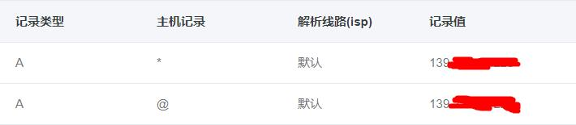

# docker image for ngrok server

 ngrok服务器的docker image，用来做内网穿透。
  
## 使用步骤：
----------------
### 1. 获取这个镜像:
```
# 直接从docker仓库拉取镜像
docker pull jueying/ngrok-server

# 考虑到国内访问docker hub很慢，也可以通过下面命令构建镜像：
docker build -t jueying/ngrok-server https://github.com/jueying/docker-ngrok-server.git
```

### 2. 在后台运行容器:
```
docker run -d --name ngrok-server -p 主机http端口:容器http端口 -p 主机https端口:容器https端口 -p 隧道port:隧道port jueying/ngrok-server 域名 容器http端口 主机https端口 隧道port

例如:
docker run -d --name ngrok-server -p 80:80 -p 8082:8082 -p 443:443 jueying/ngrok-server mydomain.cn 80 8082 443
```
运行时需要一些时间编译生成ngrok服务端和客户端，通过以下代码查看日志
```
docker logs ngrok-server
```
当出现以下日志时表示启动成功


### 3. 从容器内拷贝ngrok客户端:
```
docker cp ngrok-server:/usr/local/ngrok/bin/ /tmp/
```
在/tmp/bin/中可以找到win64, win32和macos64对应的客户端

### 4. ngrok配置使用:

1. 将你的独立域名泛解析到docker所在主机ip


2. 从容器内拷贝出相应的ngrok客户端，然后在同级目录建立配置文件ngrok.cfg,内容如下：
```
server_addr: "你的域名:隧道端口"
trust_host_root_certs: false
```
将your_domain和tunnel_port换成自己启动容器时设置的值
windows平台通过以下命令启动:
```
ngrok.exe -subdomain=子域名 -config=ngrok.cfg 本地端口
```
可以在files文件夹中[下载](https://github.com/jueying/docker-ngrok-server/blob/master/files/ngrok-client.rar)我的ngrok客户端配置，然后修改你的域名，并替换为你的ngrok客户端。

---
## 注意事项
---
1. 每次启动一个新的容器时，会生成配套的ngrok服务端和客户端。所以如果重新启动一个新的容器，需要重新拷贝新的ngrok客户端出来。启动已有的容器不用更新ngrok客户端。
